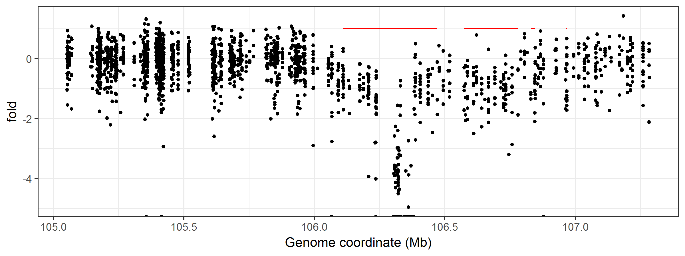

Description
===========

Nimbus is a software suite for the analysis of amplicon based sequencing data. Nimbus includes tools for data preprocessing, alignment, variant calling, quality control and visualization. The source amplicons are tracked throughout alignment and variant calling allowing probable false positive variants present in a single amplicon to be distinguished from real variants present in all amplicons at the locus. Nimbus also determines the number of reads mapped to each amplicon.

A scientific publication describing Nimbus is currently in preparation.

Guides
------

In the Nimbus manuscript, we describe an analysis of HaloPlex exome samples. For the HaloPlex exome, we expanded the design to include potential off-target amplicons. The methods for this expansion are shown [here](haloplex_design_expansion/Readme.md).

The analisys of a set of uveal melanoma samples from a study by [Koopmans *et al*](https://www.nature.com/articles/modpathol201443) is available [here](guides/custom_haloplex_design/Readme.md).

A guide on how to call structural variants with Nimbus is available [here](guides/structural_variant_calling/Readme.md).

Build instructions
------------------

The following libraries should be present and installed on your system.

* [BOOST libraries](http://www.boost.org/)
  * BOOST development libraries
* [HTSlib (version >= 1.1.; part of samtools)](http://www.htslib.org/) 
* [SAMTOOLS](http://www.htslib.org/)
* [ANNOVAR](http://annovar.openbioinformatics.org/en/latest/)
* [Python 2.7](https://www.continuum.io/downloads)
* [pysam](http://pysam.readthedocs.io/en/latest/api.html)
* [Make](https://www.gnu.org/software/make/)

In most situations, the Make and the Boost libraries are easier to install via the 
package managers that are present on most linux systems (`yum` for Redhat
or `apt` for Ubuntu). For Python, we recommend using the Anaconda, but the system
wide Python may also work. 

To compile Nimbus, go to the directory with the freshly cloned git 
repository and export the locations of the HTS-lib include and 
library files. Next use `make` to compile.

```bash
cd ${nimbus_git_repository}
export HTS_INCLUDE=${path_to_samtools}/htslib-${version}/htslib/
export HTS_LIB=${path_to_samtools}/htslib-${version}/libhts.a
make
```

After a successfull build 3 tools should be present in a newly created `${nimbus_git_repository}/bin/` directory. These tools are `nimbus_align`, `nimbus_call` and `nimbus_trim`. The other tools of Nimbus are in the scripts directory.

Run instructions
----------------

### First time setup

To run Nimbus, the tools in the Nimbus repository should be successfully compiled (see below) and SAMtools and Annovar should be present. Additionally a genome reference and a amplicon design in BED format should be available. The genome reference should be indexed with the `samtools faidx` command.

In the default workflow, Annovar annotates the results with the refGene, genomicSuperDups, avsnp147, and gerp++gt2 databases. These should all be present at the Annovar database location. Other annotation databases can be added by downloading them via Annovar and adding them in the workflow at the `protocol` and `operation` variables.

### How to run the workflow

To run the Nimbus workflow, copy the FastQ files of the samples you wish to process in an directory. These FastQ files should be preferably named `${samplename}_R1.fastq` for read 1 and `${samplename}_R2.fastq`. These files can be compressed with `gzip`. The workflow can also be started with bam files that were previously aligned with `nimbus_align`.

After preparing the run folder, set the following export variables and run the workflow with `make`.

```bash
export PATH_NIMBUS=${path_to_nimbus}/
export PATH_SAMTOOLS=${path_to_samtools}/
export PATH_PYTHON=${path_to_python}/bin/
export PATH_ZCAT=/bin/
export PATH_GZIP=/bin/
export PATH_ANNOVAR=${path_to_annovar}/
export ANNOVARDB=${path_to_annovar_database}/
export AMPLICON_DESIGN=${path_to_amplicon_design}/amplicon_design.bed
export GENOME_REFERENCE=${path_to_genome_refernece}/genome_reference.fa

make -j 3 -f ${PATH_NIMBUS}/workflows/workflow.mak
```

After a successfull run, the following output files will have been created.

| File                        | Description |
|:----------------------------|:------------|
| ${samplename}.srt.bam       | A BAM file with all the alignments |
| ${samplename}.discarded.bam | A BAM file with the discarded alignments |
| ${samplename}.passed.bam    | A BAM file with the passed alignments |
| ${samplename}.flagstat.txt  | A text file with the alignment statistics |
| ${samplename}.srt.blck      | A blck file with the counts per amplicon for all the alignments |
| ${samplename}.discarded.blck| A blck file with the counts per amplicon for the discarded alignments  |
| ${samplename}.passed.blck   | A blck file with the counts per amplicon for the passed alignments |
| combined.var.gz             | A var file with the sequence content at positions with an alternate allele |
| combined.txt                | An Annovar input file with the variants for all samples combined |
| combined.hg19_multianno.txt | An Annovar output file with the variants for all samples combined |
| combined.hg19.anno.txt      | A tabular file with the annovar annotations and variants, but with the header corrected |
| combined.hg19.mut.txt       | The variants in the [mut](https://software.broadinstitute.org/software/igv/MutationData) format for [IGV](http://software.broadinstitute.org/software/igv/home) |

Custom file formats
-------------------

### The var format

The var format is produced by `nimbus_call` and is used to record alternate alleles from a BAM file. Each record in a var file consists out of 1 line to denote the position and several subsequent lines with the sequenced bases. Comments can be placed on the top of the file with two hash signs (`##`).

The position line is tab-delimited and holds the following fields: chromosome, position, reference base number of subsequent lines, total read depth, total quality.

```var
chr1	13378	A	3	5	127
	A	1	13	sample, forward, chr1:13310-13468(-)
	A	3	112	sample, forward, chr1:13324-13511(+)
	C	1	2	sample, reverse, chr1:13310-13468(-)
```

### The blck format

The blck format produced by `nimbus_count.py` is a simple tab-delimeted format with the number of reads per amplicon. In column 1, each amplicon in the design is present encoded as follows: `chromosome:start-end(strand)`. The strand can either be a `+` or `-`. The second column has the number of reads for that amplicon.

```blck
chr10:100003494-100003993(+)	8
chr10:100003776-100003936(+)	52
chr10:100003821-100003905(+)	49
chr10:100003826-100004019(+)	16
chr10:100008136-100008288(-)	0
chr10:100008564-100008746(-)	50
```

Copy-number variant calling
---------------------------

The blck files produced by `nimbus_count.py` can also be used as input to call copy-number variants (CNVs) based on the depths of individual amplicons. To call CNVs we use the [ExomeDepth](https://cran.r-project.org/web/packages/ExomeDepth/index.html) tool from Pagnol *et al* which was published in *Bioinformatics* in 2012.

To call CNVs, a reference set is required that can either be created from a directory with `blck` files or by adding `blck` to a reference set one-by-one. The Rscripts to perform these actions can be run via the commandline as follows:

```bash
Rscript nimbus_exomedepth_create_reference_from_directory.R \
  --reference referenset.txt \
  --input directory_with_block_files

Rscript nimbus_exomedepth_add_reference.R \
  --reference referenset.txt \
  --input sample.blck
```

After a reference set is obtained, CNVs can be called with the `nimbus_exomedepth.R` script. Via the command-line parameters, many parameters of ExomeDepth can be set (see example and the [ExomeDepth manual](https://cran.r-project.org/web/packages/ExomeDepth/index.html)). In hybridisation based assays, longer exons should yield more reads. This is not likely to be true for amplicon based assays. Therefore, the bin width in the `select.reference.set` function is set to 1. The `nimbus_exomedepth.R` script saves the calls from ExomeDepth, the selected datasets, and the amplicon statistics compared to the selected reference samples. The `nimbus_exomedepth.R` script can be used as follows:

```bash
Rscript nimbus_exomedepth.R \
  --reference referenset.txt \
  --input sample.blck \
  --output sample.cnv_calls.txt \
  --threshold 10 \
  --nbins 10000 \
  --transition 10^-4 \
  --selection sample.selection.txt \
  --amplicons sample.amplicons.stats.txt
```

 Currently, CNV calling has not been implemented in a workflow. However, if the blck files are located in the current directory, the BASH commands below can be used to run the ExomeDepth on many files. Note that the `/path/to` text needs to be changed out with the path to the `nimbus_exomedepth.R` script

 ```bash
for file in `ls *.blck`; do
  sample=${file/.blck/}
  echo "Processing ${sample} with nimbus_exomedepth.R"
  Rscript /path/to/nimbus_exomedepth.R \
    --reference referenset.txt \
    --input "${sample}.blck" \
    --output "${sample}.cnv_calls.txt" \
    --threshold 10 \
    --nbins 10000 \
    --transition 10^-4 \
    --selection "${sample}.selection.txt" \
    --amplicons "${sample}.amplicons.stats.txt" ;
done
 ```

We have performed CNV on sample NA15510 using 5 other samples as a small reference set. Even-though this reference set is very small, some CNVs could still be called. The results from this analysis are linked [here](figures/exomedepth_cnv_calls.txt). The top hits and their relative coverage are shown below.



**Figure** CNVs called with ExomeDepth CNVs are shown in red. The fold change relative to the reads per million signal in the reference samples are depicted as black dots.

To create the figure the following R code was used.

```R
tf <- with(amplicon, chromosome == "chr14" & start >= 105000000 & end <= 108000000)
tx <- with(cnv_calls, chromosome == "14" & start >= 105000000 & end <= 108000000)

amplicon[tf,] %>%
  ggplot(aes(x=start/1000000, y = fold)) +
  geom_point(size = 1) +
  geom_segment(aes(x = start/1000000, xend = end/1000000, y = 1, yend = 1), colour = "red", data = cnv_calls[tx, ]) +
  theme_bw() +
  xlab("Genome coordinate (Mb)")
ggsave("figures/NA15510_chr14_CNV.png", width = 8, height = 3, dpi = 300)
```
