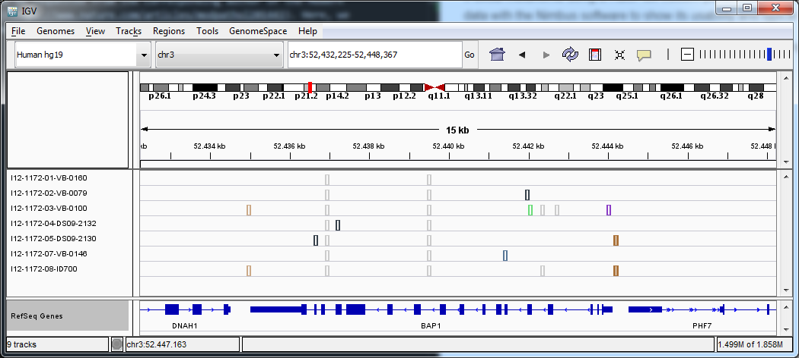

Nimbus on Uveal melanoma samples
================================

Introduction
------------

For their study published in Modern Pathology in 2014, [Koopmans *et al*](https://www.nature.com/articles/modpathol201443) characterised the BAP1 gene for 6 uveal melanoma using a HaloPlex custom panel. In the document below, we have reanalysed these data with the Nimbus software to show its usability and typical results.

The raw sequencing data can be requested from the corresponding authors of the Modern Pathology [manuscript](https://www.nature.com/articles/modpathol201443). Here, only downstream results are included.

Methods
-------

The mutations of in the BAP1 gene of 6 uveal melanoma patients were characterised with HaloPlex panel sequencing. Paired-end reads were generated on an Illumina MiSeq sequencer and subsequently aligned to the human hg19 reference genome using Nimbus. Alignments with 8 events or more were filtered before all 6 samples were called. Variants with a frequency below 10 % were removed and the result was visualized with the [IGV](http://software.broadinstitute.org/software/igv/).

To visualize variants in the IGV, custom colours were set in the preferences located at `View > Preferences > Variants > Choose colors` and the `Color code mutations` checkbox was checked.

Aside from BAP1, the HaloPlex design incorporated a number of other genes including TSC1 and TSC2. These other genes are not relevant to this study and were filtered from the analysis.

Results
-------

Between 85 and 91 % of the reads could be aligned to the HaloPlex design. Per sample, filtering removes approximately 10 % of the alignments resulting in 73 to 79 % of the reads mapped to the amplicon design.

Table 1 Alignment statistics

| sample      | reads   | mapped_reads | passed | f_mapped_reads | f_passed |
| :---------- | :-----: | :----------: | :----: | :------------: | :------: |
| I12-1172-01 | 937468  | 819208       | 721867 | 0.874          | 0.770    |
| I12-1172-02 | 1085316 | 921976       | 801539 | 0.850          | 0.739    |
| I12-1172-03 | 716476  | 612442       | 522324 | 0.855          | 0.729    |
| I12-1172-04 | 608176  | 553916       | 482888 | 0.911          | 0.794    |
| I12-1172-05 | 756404  | 685574       | 585896 | 0.906          | 0.775    |
| I12-1172-07 | 838692  | 755954       | 651777 | 0.901          | 0.777    |

All variants were called with a frequency over 1 % and a minimum quality of 10. This procedure resulted in [329 variant calls](BAP1.mut.txt) over 291 positions in the BAP1 gene. For only 21 of these positions, variants with a frequency over 10 % are [detected](BAP1.mut.txt). Thresholds for variant filtering can easily be applied in either R or Microsoft Excel.

These variants include both SNPs present in all samples as well as rarer SNPs and InDels (Figure 1). Intronic variants are indicated in grey. Frameshift deletions were detected in samples I12-1172-01, 04, and 05 (black). A splicing variant was detected in sample I12-1172-07 and mismatch was found for sample I12-1172-03.

Figure 1 Variants across the BAP1 gene, for 6 uveal melanoma patients and 1 control sample as displayed by IGV.

In conclusion
-------------

Nimbus was able to detect variants in the BAP1 gene from data generated with a custom HaloPlex design. During visual inspection in IGV, possible pathogenic mutations were determined for 5 out of 6 patients.
